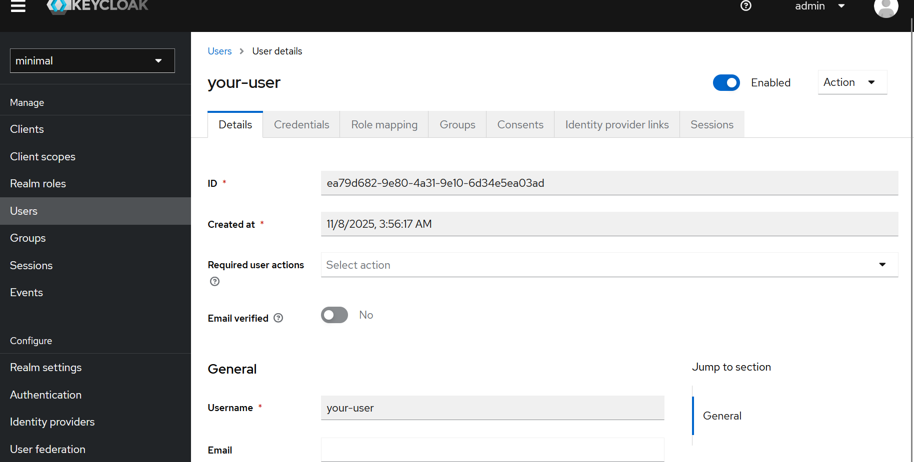
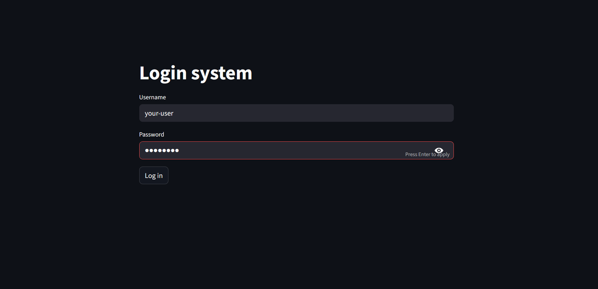
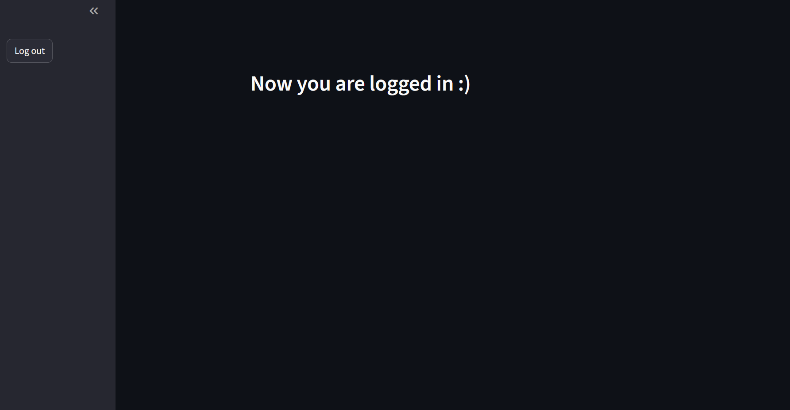

# Minimal Keycloak-Streamlit

Very basic implementation of Keycloak login in Streamlit, targeted for toy projects.

Create venv and sync it:
```
uv venv
uv sync
```

Compose up keycloak and PostgreSQL
```bash
docker compose -f docker/docker-compose.yml up -d
```

Go to `localhost:8080` and create a new user in **minimal** realm:



Run your app:

```bash
source .venv/bin/activate
streamlit run main.py
```

Go to localhost:8051 and test your new user :)




**Note:** If you run your streamlit app in another container, change the endpoint from localhost to keycloak in `settings.py`.